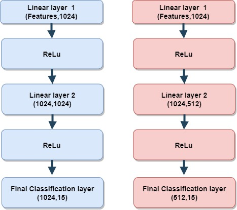
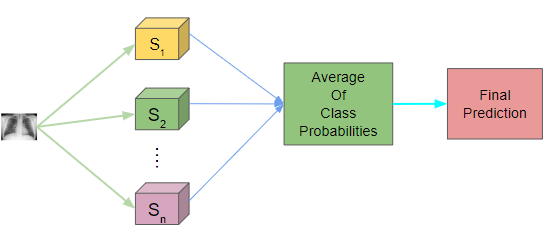
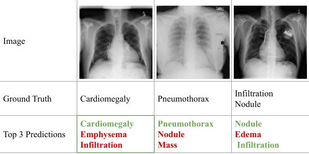

# ISBI_2024_Paper: AN ENSEMBLE OF WELL-TRAINED STUDENTS CAN PERFORM ALMOST AS GOOD AS A TEACHER FOR CHEST X-RAY DIAGNOSIS

Knowledge distillation can help in generating computationally
lightweight student models for various tasks. However,
such students often show inferior performances compared
to the teacher. In this paper, we propose an ensemble
knowledge distillation approach using a group of diverse
lightweight student models for chest x-ray diagnosis. Our
novel training mechanism try to ensure that each student is
trained well by trying to be competitive with its fellow students.
We also use a feature map loss to improve the knowledge
distillation from the teacher. The ensemble of students
is significantly lightweight in terms of computation compared
to their teacher. In spite of that, experiments for multi-label
chest x-ray diagnosis show that the ensemble of well-trained
students can perform as the teacher.

## Major Highlights:
• We introduce a knowledge distillation approach with an ensemble of lightweight student models for chest x-ray diagnosis. 
• We present a method where the knowledge distillation is performed not only with the help of the teacher model but also taking help from the fellow student models. To do this, we introduce a novel ensemble loss.. 
• We introduce a loss utilizing the feature maps of the teacher and each student model to help the knowledge distillation process.. 

## Ensemble of Students
We introduce an ensemble of lightweight student models to
perform knowledge distillation. The ensemble contains four
students with two MobileNet-v2s and two ShuffleNet-v2s.
These architectures reduce the computational load, making
them ideal for resource-constrained environments. Like the
teacher model, each student model has customized FC layers.
One MobileNet-v2 has got three FC layers containing
1024, 1024, and the final classification layer (containing
neurons equal to the number of classes in the dataset), respectively.
One ShuffleNet-v2 has got similar architectural
modifications. Another MobileNet-v2 has got three FC layers
containing 1024, 512, and the final classification layer,
respectively. The other ShuffleNet-v2 has got architectural
modifications similar to the above.

   
  <em>Fig: FC layers of students</em>

<be> 
  
## Inference through ensemble
Inference is performed through a voting mechanism by the
ensemble of student models. We average the class probabilities
from the four student models for each class. We take top k classes as the predicted classes. For a
test image, if the predicted highest probability is for No Finding,
we consider No Finding as the output label. This is done
because, if No Finding is the most likely label, the input images
may not have any abnormalities present. If No Finding
is not the prediction with the highest probability but is present
in the top k predictions, we discard No Finding and include
the (k + 1)th top prediction in the list of top k predictions.
This is done because if No Finding is not the top prediction,
it is likely that the input image has got some abnormalities.

   
  <em>Fig: A block diagram for the inference process. Each test
image is applied to every student model. Subsequently, each
student model’s predicted class probabilities (light blue arrow)
are averaged to obtain the final prediction.</em>

<be> 
  
## Computational Load Reduction:
We also evaluate the number of computations required
during inference in terms of BFLOPs per test image. For
the teacher model (DenseNet-121), the required computation
during inference is 2.90 BFLOPs. On the other hand, a
MobileNet-v2 takes 0.33 BFLOPs, and ShuffleNet-v2 takes
0.04 BFLOPs. Our ensemble of students consists of four
models, including two MobileNet-v2s and two ShuffleNetv2s.
Hence, considering all four student models, the ensemble
takes 74.48% less operation compared to the DenseNet-121
alone. The ResNet-101 takes 7.87 BFLOPs during inference.
Hence, our ensemble takes 90.59% percent less BFLOPs than
ResNet-101 alone. Thus, the proposed ensemble can significantly
reduce the computation during inference and can be
beneficial for deployment in resource-constrained environments.

   
  <em>Fig:Classification performance of the proposed method
on sample chest x-ray images from the NIHChestXray14
dataset. (Green: Correct diagnosis, Red: Incorrect diagnosis).</em>

<be><be>
  
## Requirements: 
1. Python 3.8.  
2. PyTorch 2.0.  

